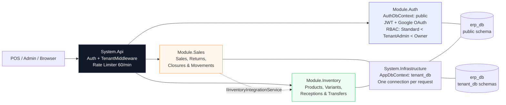

# DriveCore — One instance, many businesses

> A multi-tenant, modular ERP backend built to make small-retailer SaaS in LatAm actually profitable — one deploy serves every client, from a feria stall with SKUs like `NIK12-011` to a formal distributor.

**Frontend:** [Talla — POS for how South America actually sells](https://github.com/ronaldz012/inventory_system) — Angular 21 · Tailwind · Auth0 · PWA
**Stack:** .NET 9 · EF Core · PostgreSQL · Auth0 (custom domain `auth.ronaldz.work`)
**Tests:** 144/144 passing (Auth 25 | Sales 35 | Inventory 84)

---

## Why this exists

70% of retail in Bolivia and across LatAm is informal — corner stores and ferias where a product is `Forum Low / 42 / Navy Blue` with a loose SKU, not a GTIN. A formal ERP per client means a DB per client, and the hosting bill kills your margin at $15-30/month.

**DriveCore fixes the economics:** one deploy, many businesses. Each tenant sees only its own data, but you run a single `erp_db` and a single API. Onboarding takes minutes, marginal cost is near zero — so you can actually charge what the market can pay.

---

## Architecture at a glance



*One codebase, one deploy today — extract a module to a service tomorrow without rewriting.*

Modules never reference each other directly, only shared contracts (`IInventoryIntegrationService`, `IBranchService`). `Auth` lives on its own schema and can provision a tenant before that tenant even has a data context — everything else shares one `AppDbContext` per request, with full ACID transactions across modules.

---

## The hard part: multi-tenant without a rewrite

Most multi-tenant systems start multi-tenant. DriveCore didn't — it started as single-tenant code, and stayed that way *from the developer's point of view*.

Your `ListProducts` and `CreateSale` methods look identical to how they'd look in a single-client system. Under the hood, three things make it multi-tenant:

1. A `TenantId` column plus a global query filter — every query automatically gets an invisible `WHERE TenantId = ...`. There's no way to accidentally query across tenants.
2. `SaveChangesAsync` auto-seals `TenantId` on every new record and freezes it on updates — services never have to remember to set it themselves.
3. One migration (`AddColumn TenantId`) turned the whole system multi-tenant. No parallel rewrite, no duplicated logic.

That's roughly 80% of the multi-tenancy work, and your business logic never had to know it exists.

**Flexible enough for the street, strict enough for accounting**

- No rigid catalog required: quick SKUs, `Size/Color` variants, manual price/stock patches.
- Returns are first-class, not a bolt-on: a return stores a negative quantity and amount, so every report nets correctly with a simple `SUM` — no special-casing in reporting code.
- Cash registers enforce one open drawer per branch at the database level, not just in application code.
- Feature flags per branch (`AllowedFeatureKeys`) let a small kiosk run POS-only while a depot runs transfers and receptions — same codebase, gated by plan.

---

## What it does

**Sales that survive the rush** — Stock-guarded sale creation with a fail-fast validation pattern, returns as first-class citizens (full or partial, with tracked returnable quantity), and a single-lookup search built for fast POS checkout.

**Cash you can audit** — Full register lifecycle (open → live session → close) with expected vs. counted totals and the difference automatically calculated; soft-deleted movements are excluded everywhere by default, not filtered ad hoc.

**Inventory that matches the street** — Product search by name or internal code, missing branch inventory defaults to zero instead of breaking the UI, and receptions/transfers keep a running weighted average cost.

**Auth that scales** — New users are provisioned directly in Auth0 and receive a password-setup invitation; sessions are cached for 30 minutes to cut down on auth roundtrips, with a separate API-key path for admin/system access.

---

## Try it

```bash
git clone https://github.com/ronaldz012/DriveCore.System.Monolith.git
cd DriveCore.System.Monolith
dotnet build src/System.Api/System.Api.csproj

# Auth DB (public schema)
dotnet ef database update --project src/modules/Module.Auth/Module.Auth.csproj --startup-project src/System.Api/System.Api.csproj --context AuthDbContext
# Tenant DB (tenant_db schema)
dotnet ef database update --project src/System.Infrastructure/System.Infrastructure.csproj --startup-project src/System.Api/System.Api.csproj --context AppDbContext

dotnet run --project src/System.Api
# API docs: https://localhost:5253/scalar/v1
```

Requires `appsettings.json` with `ConnectionStrings:DefaultConnection/TenantConnection` and `Auth0:Domain/Issuer/Audience` — see `appsettings.Example.json`.

```bash
dotnet test
# → 144/144 passing (Auth 25 | Sales 35 | Inventory 84)
```

---

## See the frontend

The API is only half the story. The counter-first UI that drives it:

**→ Frontend: [Talla — POS for how South America actually sells](https://github.com/ronaldz012/inventory_system)** — scanner-first cart, signal-driven totals, bottom-sheet modals, per-branch view memory.